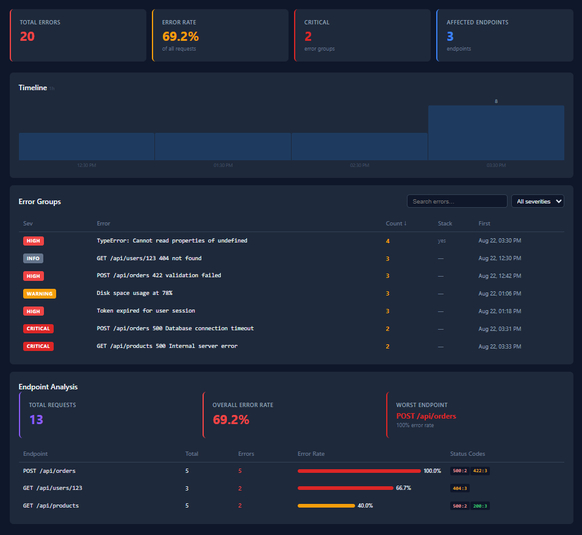

# Production Error Analyzer

[](https://github.com/jaber-pishdar/production-error-analyzer/actions/workflows/ci.yml)
[](LICENSE)

---

## Why?

Every team that runs software in production knows the drill:

An alert fires. You open the logs. Thousands of lines. No grouping. No context. The same stack trace repeated 200 times. You spend 30–60 minutes just figuring out *what* broke before you can even start fixing it.

**Production Error Analyzer** solves this: paste your logs, get a clean dashboard in seconds — grouped errors, severity, timeline spikes, endpoint breakdown, regression detection.

---

## What This Tool Does

| Input | Output |
|-------|--------|
| Raw log lines (timestamp + level + message) | Grouped errors with occurrence counts |
| Stack traces | Fingerprinted by type + function chain |
| HTTP request logs (GET /api/users 200) | Per-endpoint error rates and status code distribution |
| A release timestamp | Regression detection — before vs after error rates |
| 48 hours of logs | Time-series chart with spike highlighting |

---

## Example Incident

Deploy a buggy release → paste the logs → see this:



```
● Total Errors: 1,247
● Error Rate: 34.2%
● Critical Groups: 3
● Affected Endpoints: 5

  Sev    Error                         Count   Stack
  ─────  ────────────────────────────  ─────   ─────
  CRIT   TypeError: Cannot read...     431     yes
  HIGH   POST /api/orders 500 timeout  218     —
  HIGH   GET /api/products 500         156     —

  ⚡ Spike detected at 12:00 (87 errors, 3.4× average)

  ⚠ Regression detected: error rate jumped from 5.2 to 92.3 errors/hour
```

---

## Architecture

```
┌────────────────────────────────────────────────────┐
│                    Single Container                 │
│  ┌────────────────┐      ┌──────────────────────┐  │
│  │  apps/web       │ ──→ │      apps/api         │  │
│  │  (React + Vite) │ API  │  (Node + Express)    │  │
│  └────────────────┘      └──────┬───────────────┘  │
│                                  │                  │
│  ┌───────────────────────────────▼───────────────┐  │
│  │  packages/                                     │  │
│  │    parser/    — Log format parsers              │  │
│  │    analyzer/  — Fingerprinting, grouping,       │  │
│  │                 severity, time analysis,         │  │
│  │                 HTTP metrics, regression         │  │
│  │    shared/    — TypeScript types                 │  │
│  └───────────────────────────────────────────────┘  │
└────────────────────────────────────────────────────┘
```

---

## Features

- **Error Grouping** — identical errors are automatically grouped by fingerprint (error type + message + stack frames)
- **Severity Classification** — each group gets a severity: info → low → warning → high → critical
- **HTTP Analysis** — per-endpoint error rates, status code distribution, worst endpoint
- **Timeline** — hourly error buckets with automatic spike detection (>3x mean)
- **Regression Detection** — compare error rates before and after a release timestamp
- **Search & Filter** — search by message, filter by severity, sort by count/time/severity
- **Error Detail View** — full message, stack trace, first/last seen, severity badge

---

## Tech Stack

| Layer | Technology |
|-------|-----------|
| Frontend | React + TypeScript + Vite |
| Backend | Node.js + Express + TypeScript |
| Processing | Pure TypeScript (no external ML/AI) |
| Container | Docker + Docker Compose |
| CI | GitHub Actions (lint → test → build) |

---

## Run Locally

### Docker (recommended — single command)

```bash
git clone https://github.com/jaber-pishdar/production-error-analyzer.git
cd production-error-analyzer
docker compose up
```

Open http://localhost:4000.

### Local development

```bash
pnpm install
pnpm dev
```

API: http://localhost:4000 — Frontend: http://localhost:3000

### Seed data

```bash
pnpm run seed | curl -X POST http://localhost:4000/api/parse --data-binary @-
```

### Test

```bash
pnpm test       # 78 tests, all passing
```

---

## Roadmap

- [x] Log parsing (Node.js format)
- [x] Error fingerprinting and grouping
- [x] Severity classification
- [x] HTTP endpoint analysis
- [x] Time-series aggregation with spike detection
- [x] Regression detection
- [x] Dashboard UI with search, filter, sort
- [x] Docker one-command deploy
- [ ] Multi-format support (JSON, Apache, PHP, Python)
- [ ] Real-time log streaming via WebSocket
- [ ] Persistent storage (PostgreSQL + TimescaleDB)
- [ ] GitHub Actions integration (auto-analyze CI failures)

---

## Why I Built This

I've been the person staring at production logs at 2AM, trying to understand why a deployment broke. The tools that exist are either too heavy (full APM suites) or too simple (grep).

This project is the middle ground — a focused, self-contained tool that does one thing well: **turn noisy logs into clear answers**. It's also a demonstration of clean TypeScript architecture, monorepo structure, and developer-first UX.

---

## License

MIT